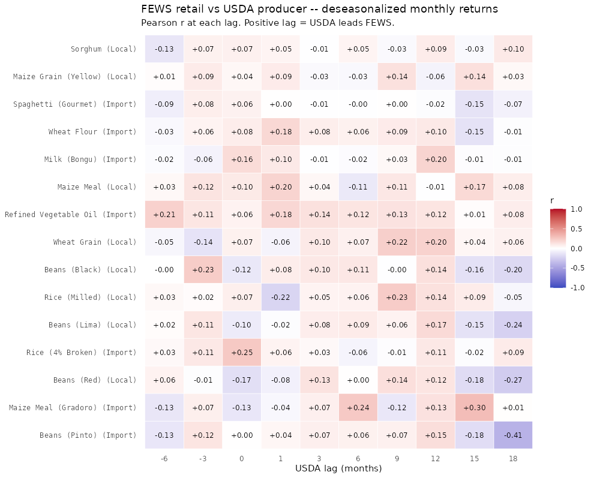

# USDA-vs-FEWS multi-pair correlation experiment

Pairs tested: 17. USDA series fetched: 7.
FEWS data through: 2026-03-01.
USDA data through: 2026-03-01.

## Verdict per pair (deseasonalized monthly returns)

Headline test: does USDA US-producer price *change* lead the FEWS Haiti
retail price *change* at any lag from −6 to +18 months, after removing
month-of-year seasonality from both sides?

**FX control:** FEWS retail prices are taken in USD (FEWS's own conversion
using the prevailing HTG/USD rate at observation time). This strips out
HTG depreciation / domestic inflation, which would otherwise produce a
shared trend with any nominal USD series.

- **GO** Beans (Pinto) (Import) ↔ beans_dry_edible: |r| = 0.406 at lag = +18 (n = 52) **
- no-go Maize Meal (Gradoro) (Import) ↔ corn: best |r| = 0.299 at lag = +15 (n = 54)
- no-go Beans (Red) (Local) ↔ beans_dry_edible: best |r| = 0.265 at lag = +18 (n = 52)
- no-go Rice (4% Broken) (Import) ↔ rice: best |r| = 0.248 at lag = +0 (n = 70)
- no-go Beans (Lima) (Local) ↔ beans_dry_edible: best |r| = 0.237 at lag = +18 (n = 50)
- no-go Rice (Milled) (Local) ↔ rice: best |r| = 0.230 at lag = +9 (n = 70)
- no-go Beans (Black) (Local) ↔ beans_dry_edible: best |r| = 0.230 at lag = -3 (n = 70)
- no-go Wheat Grain (Local) ↔ wheat: best |r| = 0.218 at lag = +9 (n = 127)
- no-go Refined Vegetable Oil (Import) ↔ soybeans: best |r| = 0.209 at lag = -6 (n = 166)
- no-go Maize Meal (Local) ↔ corn: best |r| = 0.197 at lag = +1 (n = 144)
- no-go Milk (Bongu) (Import) ↔ milk: best |r| = 0.197 at lag = +12 (n = 127)
- no-go Wheat Flour (Import) ↔ wheat: best |r| = 0.178 at lag = +1 (n = 172)
- no-go Spaghetti (Gourmet) (Import) ↔ wheat: best |r| = 0.146 at lag = +15 (n = 77)
- no-go Maize Grain (Yellow) (Local) ↔ corn: best |r| = 0.142 at lag = +15 (n = 146)
- no-go Sorghum (Local) ↔ sorghum: best |r| = 0.129 at lag = -6 (n = 67)

Threshold for GO: |r| >= 0.30 at the best lag (n ~ 70 → p ~ 0.01).

## Best lag per (pair, basis)

### Deseasonalized monthly returns (headline)

| FEWS commodity | source | USDA | best lag | r | n | p | sig |
|---|---|---|---:|---:|---:|---:|---|
| Beans (Pinto) | Import | beans_dry_edible | +18 | -0.406 | 52 | 0.0029 | ** |
| Maize Meal (Gradoro) | Import | corn | +15 | +0.299 | 54 | 0.028 | * |
| Beans (Red) | Local | beans_dry_edible | +18 | -0.265 | 52 | 0.057 |  |
| Rice (4% Broken) | Import | rice | +0 | +0.248 | 70 | 0.039 | * |
| Beans (Lima) | Local | beans_dry_edible | +18 | -0.237 | 50 | 0.097 |  |
| Rice (Milled) | Local | rice | +9 | +0.230 | 70 | 0.055 |  |
| Beans (Black) | Local | beans_dry_edible | -3 | +0.230 | 70 | 0.056 |  |
| Wheat Grain | Local | wheat | +9 | +0.218 | 127 | 0.014 | * |
| Refined Vegetable Oil | Import | soybeans | -6 | +0.209 | 166 | 0.007 | ** |
| Maize Meal | Local | corn | +1 | +0.197 | 144 | 0.018 | * |
| Milk (Bongu) | Import | milk | +12 | +0.197 | 127 | 0.027 | * |
| Wheat Flour | Import | wheat | +1 | +0.178 | 172 | 0.019 | * |
| Spaghetti (Gourmet) | Import | wheat | +15 | -0.146 | 77 | 0.2 |  |
| Maize Grain (Yellow) | Local | corn | +15 | +0.142 | 146 | 0.088 |  |
| Sorghum | Local | sorghum | -6 | -0.129 | 67 | 0.3 |  |

### Raw monthly returns

| FEWS commodity | source | USDA | best lag | r | n | p | sig |
|---|---|---|---:|---:|---:|---:|---|
| Beans (Pinto) | Import | beans_dry_edible | +18 | -0.349 | 52 | 0.011 | * |
| Maize Meal (Gradoro) | Import | corn | +15 | +0.341 | 54 | 0.012 | * |
| Rice (Milled) | Local | rice | +1 | -0.319 | 70 | 0.0071 | ** |
| Beans (Lima) | Local | beans_dry_edible | +18 | -0.273 | 50 | 0.055 |  |
| Beans (Red) | Local | beans_dry_edible | +18 | -0.257 | 52 | 0.066 |  |
| Maize Meal | Local | corn | -3 | +0.255 | 144 | 0.0021 | ** |
| Wheat Grain | Local | wheat | +12 | +0.232 | 127 | 0.0086 | ** |
| Maize Grain (Yellow) | Local | corn | +6 | -0.211 | 146 | 0.011 | * |
| Beans (Black) | Local | beans_dry_edible | -3 | +0.204 | 70 | 0.09 |  |
| Milk (Bongu) | Import | milk | +12 | +0.198 | 127 | 0.026 | * |
| Refined Vegetable Oil | Import | soybeans | -6 | +0.183 | 166 | 0.018 | * |
| Wheat Flour | Import | wheat | +1 | +0.167 | 172 | 0.029 | * |
| Sorghum | Local | sorghum | -3 | +0.128 | 70 | 0.29 |  |
| Rice (4% Broken) | Import | rice | +1 | +0.119 | 70 | 0.33 |  |
| Spaghetti (Gourmet) | Import | wheat | -6 | -0.113 | 77 | 0.33 |  |

### Deseasonalized log levels

| FEWS commodity | source | USDA | best lag | r | n | p | sig |
|---|---|---|---:|---:|---:|---:|---|
| Rice (4% Broken) | Import | rice | +0 | +0.940 | 72 | 2.4e-34 | *** |
| Spaghetti (Gourmet) | Import | wheat | +3 | +0.843 | 79 | 1.9e-22 | *** |
| Wheat Grain | Local | wheat | +12 | +0.780 | 130 | 7.5e-28 | *** |
| Milk (Bongu) | Import | milk | +6 | +0.715 | 130 | 1.2e-21 | *** |
| Refined Vegetable Oil | Import | soybeans | +3 | +0.661 | 177 | 1.3e-23 | *** |
| Wheat Flour | Import | wheat | +9 | +0.650 | 177 | 1.3e-22 | *** |
| Maize Grain (Yellow) | Local | corn | -3 | +0.617 | 147 | 8.3e-17 | *** |
| Maize Meal (Gradoro) | Import | corn | +15 | +0.607 | 59 | 3.4e-07 | *** |
| Beans (Black) | Local | beans_dry_edible | +9 | +0.569 | 64 | 9.5e-07 | *** |
| Beans (Red) | Local | beans_dry_edible | +18 | +0.545 | 55 | 1.7e-05 | *** |
| Beans (Lima) | Local | beans_dry_edible | +18 | +0.532 | 53 | 4.1e-05 | *** |
| Maize Meal | Local | corn | +0 | +0.499 | 151 | 7.1e-11 | *** |
| Beans (Pinto) | Import | beans_dry_edible | +9 | +0.436 | 64 | 0.00031 | *** |
| Rice (Milled) | Local | rice | +1 | -0.261 | 74 | 0.025 | * |
| Sorghum | Local | sorghum | -6 | +0.181 | 74 | 0.12 |  |

### Raw log levels (interpret with care — trend-shared)

| FEWS commodity | source | USDA | best lag | r | n | p | sig |
|---|---|---|---:|---:|---:|---:|---|
| Rice (4% Broken) | Import | rice | +0 | +0.935 | 72 | 2.6e-33 | *** |
| Spaghetti (Gourmet) | Import | wheat | +1 | +0.840 | 79 | 3.7e-22 | *** |
| Wheat Grain | Local | wheat | +9 | +0.771 | 130 | 8.1e-27 | *** |
| Milk (Bongu) | Import | milk | +12 | +0.698 | 130 | 2.8e-20 | *** |
| Refined Vegetable Oil | Import | soybeans | +6 | +0.654 | 177 | 5.7e-23 | *** |
| Wheat Flour | Import | wheat | +9 | +0.649 | 177 | 1.5e-22 | *** |
| Maize Grain (Yellow) | Local | corn | -3 | +0.620 | 147 | 5.7e-17 | *** |
| Maize Meal (Gradoro) | Import | corn | +6 | +0.613 | 59 | 2.5e-07 | *** |
| Beans (Black) | Local | beans_dry_edible | +9 | +0.562 | 64 | 1.3e-06 | *** |
| Beans (Red) | Local | beans_dry_edible | +18 | +0.505 | 55 | 8.3e-05 | *** |
| Maize Meal | Local | corn | -3 | +0.501 | 151 | 5.8e-11 | *** |
| Beans (Pinto) | Import | beans_dry_edible | +9 | +0.443 | 64 | 0.00025 | *** |
| Beans (Lima) | Local | beans_dry_edible | +18 | +0.404 | 53 | 0.0027 | ** |
| Rice (Milled) | Local | rice | +1 | -0.264 | 74 | 0.023 | * |
| Sorghum | Local | sorghum | -6 | +0.156 | 74 | 0.18 |  |

## Plots

- 
- One `lag_scan_<pair>.png` per pair (4-panel: levels/returns × raw/deseasonalized)
- One `overlay_<pair>.png` per pair (level overlay since 2019, dual axis)

## Caveats

- USDA `BEANS, DRY EDIBLE, (EXCL CHICKPEAS)` is the aggregate dry-bean
  class (Black + Pinto + Navy + Kidney + ...). Black-specific FEWS prices
  are paired against this aggregate. Multiple FEWS bean variants share
  the same USDA series.
- Sugar uses sugarcane producer-price (the dominant raw-cane series).
  FEWS measures refined retail; the supply chain is multi-step.
- Vegetable oil pairs against SOYBEAN producer price (US oils are mostly
  soybean by volume) rather than a direct refined-oil price.
- All USDA series are US-producer prices; FEWS is Haitian retail. Each
  pair therefore measures a global producer-price signal against a
  country-level retail signal with import + markup steps in between.
- Coverage windows differ by USDA series. Check `n` in best_lags.csv before
  acting on a marginal pair.
- Reported p-values assume independence — they ignore autocorrelation in
  the residuals so the true p is somewhat larger. Treat as a sanity
  signal, not a statistical test.
