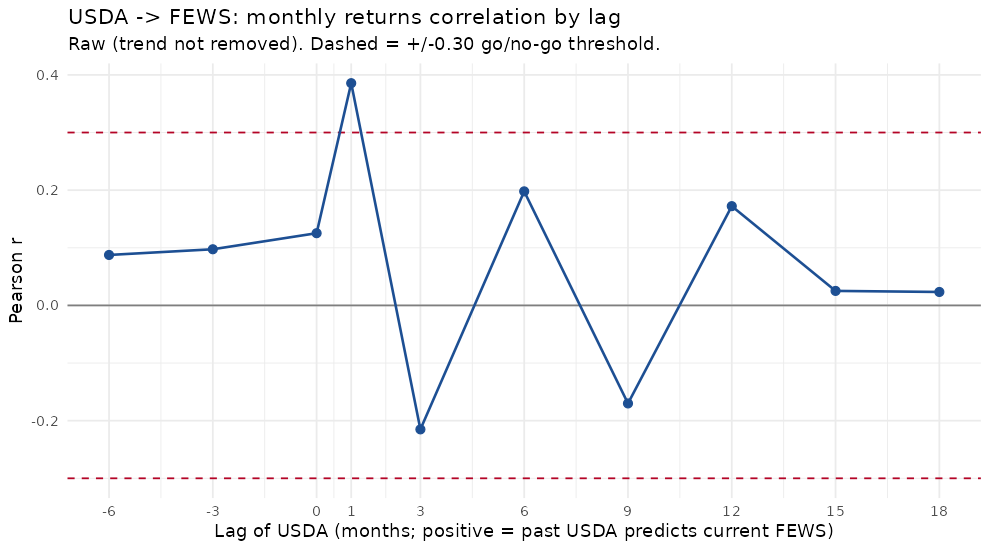
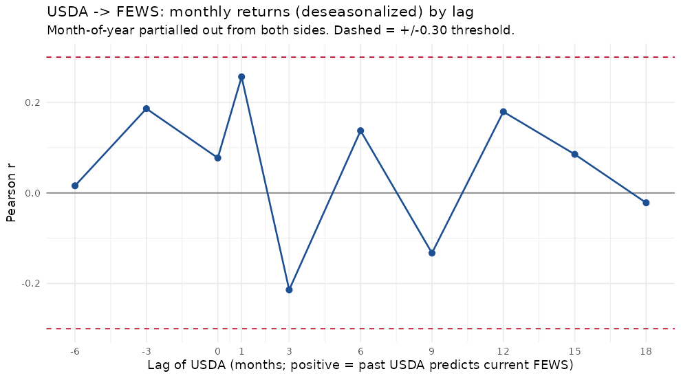
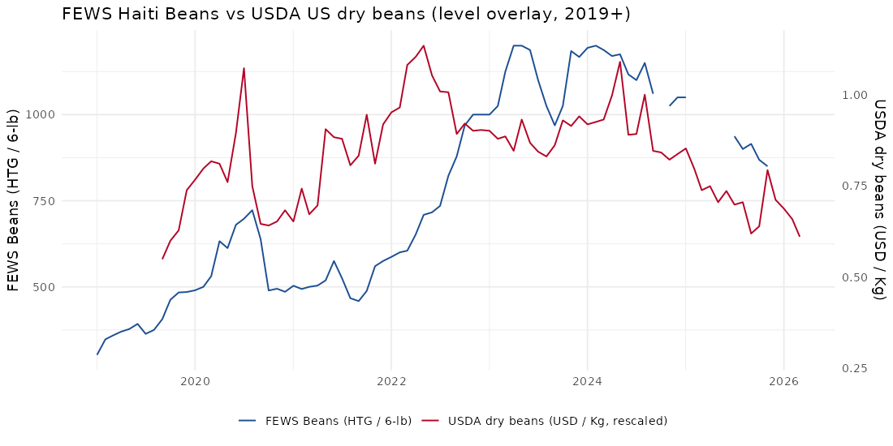
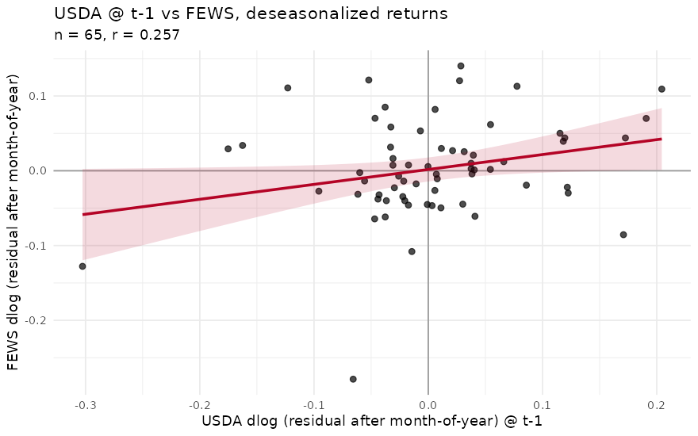

# USDA-vs-FEWS correlation experiment

**Overlap window:** 2019-09-01 to 2026-03-01 (n = 70 months)

Tests whether US producer prices for dry edible beans (aggregate class,
excluding chickpeas) lead Haiti's FEWS Beans (Black) retail price at any
practical lag. If yes, the USDA series would be a candidate additional
regressor for v09 (similar to ACLED but with a much shorter operational
lag -- NASS releases monthly data with ~1-month delay vs ACLED's 12).

## Verdict

**NO-GO: best |r| = 0.257 at lag = 1 is below the 0.30 threshold. The USDA aggregate dry-bean series does not lead Haiti's FEWS beans strongly enough to justify wiring into the model. Document as a negative result.**

## Headline lag scan (deseasonalized monthly returns)

This is the cleanest test -- removes both trend (returns) and month-of-year
seasonality. Positive lag = past USDA predicts current FEWS.

### Deseasonalized Delta-log correlations

| lag (months) | r | n | p | sig |
|---|---|---|---|---|
| -6 | +0.016 | 70 | 0.9 |  |
| -3 | +0.186 | 69 | 0.13 |  |
| 0 | +0.077 | 66 | 0.54 |  |
| 1 | +0.257 | 65 | 0.039 | * |
| 3 | -0.214 | 63 | 0.092 |  |
| 6 | +0.137 | 60 | 0.29 |  |
| 9 | -0.133 | 57 | 0.32 |  |
| 12 | +0.179 | 54 | 0.19 |  |
| 15 | +0.085 | 51 | 0.55 |  |
| 18 | -0.022 | 48 | 0.88 |  |

## Other tables

### Raw Delta-log correlations

| lag (months) | r | n | p | sig |
|---|---|---|---|---|
| -6 | +0.088 | 70 | 0.47 |  |
| -3 | +0.097 | 69 | 0.43 |  |
| 0 | +0.125 | 66 | 0.32 |  |
| 1 | +0.386 | 65 | 0.0015 | ** |
| 3 | -0.215 | 63 | 0.09 |  |
| 6 | +0.198 | 60 | 0.13 |  |
| 9 | -0.170 | 57 | 0.21 |  |
| 12 | +0.172 | 54 | 0.21 |  |
| 15 | +0.025 | 51 | 0.86 |  |
| 18 | +0.023 | 48 | 0.87 |  |

### Deseasonalized log-level correlations

| lag (months) | r | n | p | sig |
|---|---|---|---|---|
| -6 | +0.149 | 73 | 0.21 |  |
| -3 | +0.307 | 72 | 0.0087 | ** |
| 0 | +0.390 | 70 | 0.00085 | *** |
| 1 | +0.429 | 69 | 0.00023 | *** |
| 3 | +0.483 | 67 | 3.5e-05 | *** |
| 6 | +0.570 | 64 | 8.9e-07 | *** |
| 9 | +0.621 | 61 | 9.2e-08 | *** |
| 12 | +0.710 | 58 | 4.2e-10 | *** |
| 15 | +0.712 | 55 | 1.1e-09 | *** |
| 18 | +0.631 | 52 | 5.2e-07 | *** |

### Raw log-level correlations (interpret with care -- trend-shared)

| lag (months) | r | n | p | sig |
|---|---|---|---|---|
| -6 | +0.163 | 73 | 0.17 |  |
| -3 | +0.287 | 72 | 0.015 | * |
| 0 | +0.400 | 70 | 0.00061 | *** |
| 1 | +0.445 | 69 | 0.00013 | *** |
| 3 | +0.482 | 67 | 3.6e-05 | *** |
| 6 | +0.528 | 64 | 7.4e-06 | *** |
| 9 | +0.572 | 61 | 1.4e-06 | *** |
| 12 | +0.679 | 58 | 4.8e-09 | *** |
| 15 | +0.642 | 55 | 1.3e-07 | *** |
| 18 | +0.595 | 52 | 3.3e-06 | *** |

## Plots

- 
- 
- 
- 

## Caveats

- USDA series is the **aggregate** dry-edible-bean class (Black + Pinto +
  Navy + Kidney + ...). Black beans are ~10-15% of US production by volume,
  so this is a noisy proxy for what we'd ideally have (Black-specific).
- USDA reports US producer prices; FEWS is Haitian retail. The supply
  chain (US export -> import -> Haitian retail markup) is multi-step.
- Coverage is short (since 2019). Power is limited; CIs are wide.
- n ~ 70 vs r = 0.30 has p ~ 0.01, so the chosen threshold is roughly
  the bar for 'significant at 1%'.
